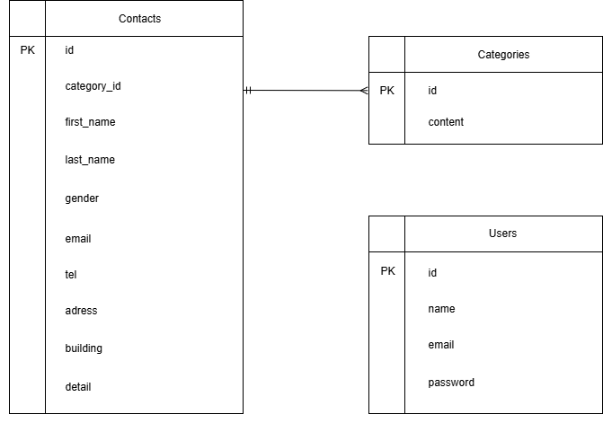

# お問い合わせフォーム

## 環境構築
1. 新規リポジトリ作成
    - リモートリポジトリ作成
    - ローカルリポジトリ作成（add,commit,push）

2. Dockerコンテナ起動
    - ディレクトリ構成
    - ymlファイル作成
    - docker-compose up -d -build

3. Laravel環境構築
    - docker-compose exec app bash
    - composer install
    - composer create-project laravel/laravel .
    - 時間設定　Asia/Tokyo
    - .gitignore作成

4. DB
    - php artisan make:migration
    - php artisan migrate
    - php artisan db:seed
    - php artisan make:factory

## 使用技術(実行環境)
- 言語： PHP 8.1.33 / JavaScript 
- フレームワーク： Laravel 10.49
- データベース： MySQL 8.0.26, phpMyAdmin 
- Webサーバー： Nginx 1.21.1
- 開発環境： Docker Desktop 28.3.2, Docker compose 2.38.2, Composer 8.0.26

## ER図
< - - - 作成したER図の画像 - - - >

## URL
- 開発環境：http://localhost/
